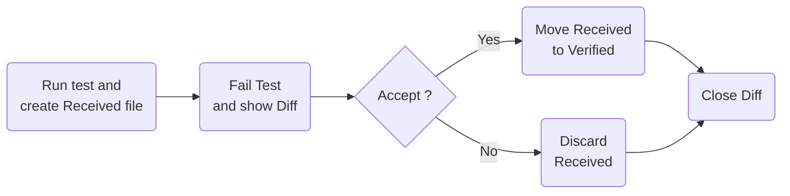
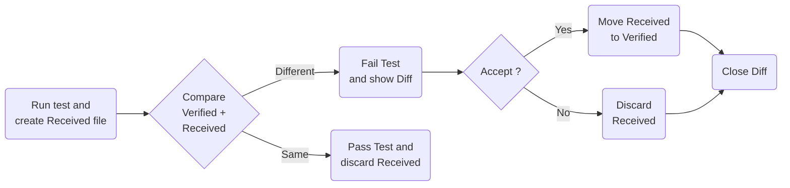

---
src: ./pages/01-intro.md
---

---
layout: image-left
image: /images/machine4.jpg
---

## Legacy-Context

- Domain
- Tech-Stack(s)
- Architecture

---
layout: image-left
image: /images/science.jpg
---

## Domain

- expert system
- user: engineers in sales
- Special features:
  - SI units
  - floating point numbers
  - mathematics
    - not just rule of three
    - complex formulas (including integral calculus)
    - a lot of formulas (x * 10^3 LoC)
    - mathematics is core domain!
- perfect match for my background 😎

---
layout: image-right
image: /images/machine2.jpg
---

## Tech-Stack(s)

- Main Stack: **LAMP**
  - **L**inux
  - **A**pache
  - **M**ySQL
  - **P**HP
  - ✨ Angular 1 (!) ✨
- Other Stacks
  - C++
  - MATLAB

---
layout: image-left
image: /images/machine3.jpg
---

## Architecture

- Frontend (FE): Angular 1
- Backend (BE): PHP
- Bonus: External system calls to FE & BE
  - Let's ignore this for now

---
layout: image-right
image: /images/feathers-legacy-code.jpg
---

## Find a "Seam"

- What is a Seam? 👉 M. Feathers "Working Effectively with Legacy Code"
- "a seam is a place where you can alter behavior in your program without editing in that place"
- I used a "feature toggle" as seam

---

## Find a "Seam" - Example

Redirecting a php request to a new **dotnet console** application

```php {all|4|5-6,9-10|all}
// Somewhere inside a PHP controller class...
//
// Seam which toggles between PHP and .NET
if ($this->useDotNet) { // 👈 Feature Toggle
  // C# calculation (new)
  return $this->calcDotNet("calculate", $request);
}
else {
  // PHP calculation (legacy)
  return new CalcWithPhp($request);
}
```

```php
// ⚠️ Use the "Seam"
function calcDotNet($endpointName, Request $request)
{
  // ...
  $encodedJson = base64_encode($request->getContent());
  $result = shell_exec("".$dotnetProgramm." ".$endpointName."  ".$encodedJson."");
  return $result;
}
```

<style>
.slidev-code {
  font-size: 10px !important;
  line-height: 13px !important;
}
</style>

---

## Porting Code from PHP to C# (1/2)

<v-clicks>

- ⚠️ Pay attention to data structures (dynamic vs. static typing)

```php {1|1-2|1-3|all}
$foo[1] = 1;                  // 👈 is foo an int ?
$foo[2] = 2.3;                // 👈 or a float ?
$foo[3] = "3";                // 👈 or a string ?
// ...
// in some derived class (developed years later, by a different developer):
$foo["bar"] = [1, "2", 3.3];  // 👈 or ???
```

- and floating point numbers (more on that later)...

</v-clicks>

---

## Porting Code from PHP to C# (2/2)

<v-clicks>

- a lot of typing (no AI usage)
- Restructuring / Refactoring:
  - ⚠️ Be extremely careful and conservative with restructuring
  - I disagreed with certain decisions in the old system (in my opinion way too much inheritance, followed by a lot of if/else in base classes)
    - 👉 I mapped each product type to an independent type without inheritance (a lot of **code duplication**)
    - 👉 I added "Stateless constructs": even more **code duplication**
- took 2-3 months
- no tests during that time 😭😭😭

</v-clicks>

---
layout: image-left
image: /images/frozen.jpg
---

**Walking on water** and **developing software** from a specification are easy if both are **frozen**. -- Edward V. Berard

<style>
  p {
    margin-top: 5em;
  }
strong {
  font-size: 1.2em;
  color: #c5003e;
}
</style>

---

## Testing the Ported Code

- Get hundreds of realistic example JSONs from the customer
- Run through the old system, save responses
- Run through the new system, compare responses with saved responses
- Rinse and repeat until the code coverage of the new .NET code is close to 100%
  - Extensive use of code coverage tools

How does that work in detail?

---

## Definitions

- Golden Master Test
- Approval Testing
- Snapshot Testing
- Verify
- Regression Test
- Acceptance Test
- Characterization Test

We'll stick with <span v-mark.underline.orange="1">"Approval Testing"</span> and <span v-mark.underline.orange="1">"Verify"</span> for now.
And discuss the others later...

---

## Initial Workflow

- No existing `.verified.` file.



---

## Subsequent Workflow

- Existing `.verified.` file is compared with `.received.` file...



---

## Hello World Example

```cs
public record Person(string FirstName, string LastName, int Age);
```

```cs
// ⚠️ Fact must return Task!
[Fact]
public Task VerifyPersonTest()
{
    var homer = new Person("Homer", "Simpson", 39);
    return Verify(homer); // 👈 don't forget to "return" the Task 
}
```

Verified text file:

```json
{
  FirstName: Homer,
  LastName: Simpson,
  Age: 39
}
```

---
layout: two-cols-header
---

## Where is the Arrange-Act-Assert (GWT)?

::left::

```cs
public record PersonRequest(string FirstName, string LastName, int Age);
public record PersonResponse(string FirstName, string LastName, int Age)
{
  public static PersonResponse FromRequest(PersonRequest request) =>
    new (request.FirstName, request.LastName, request.Age);
}
```

```cs
[Fact]
public Task PersonResponse_FromRequest()
{
  // Arrange / Given
  PersonRequest homer = new ("Homer", "Simpson", 39);

  // Act / When
  var actual = PersonResponse.FromRequest(homer);
  
  // Assert / Then
  return Verify(actual);
}
```

::right::

Verified text file:

```json
{
  FirstName: Homer,
  LastName: Simpson,
  Age: 39
}
```

AAA vs GWT is the same mindset

<style>
.two-cols-header {
  display: grid;
  grid-template-columns: repeat(2, 1fr);
  grid-template-rows: auto 1fr auto; /* Adjust to fit content */
}

/* Adjust other styles as necessary to fit the new grid definition */
.col-bottom {
  align-self: end;
  grid-area: 3 / 1 / 4 / 3; /* Adjust this to correctly place the bottom area */
}

.col-left {
  padding-right: 10px !important; /* This has no effect */
}

.two-cols-header {
  display: grid;
  grid-template-columns: repeat(2, 1fr);
  grid-template-rows: auto 1fr auto;
  column-gap: 20px; /* Adjust the gap size as needed */
}
</style>

---
layout: image-left
image: /images/randomness.jpg
---

## Verify - Randomness

No problem 👉 "Scrubbers" to the rescue

- GUIDs (by default)
- TimeStamps (by default)

---
layout: two-cols-header
---

## Randomness - Default Scrubbers

::left::

```cs {all|5-8,19-23}
public record Person(
    string FirstName,
    string LastName,
    int Age,
    Guid Id,              // 👈
    DateTime? AquiredAt,  // 👈
    DateTime CreatedAt,   // 👈
    DateTime? UpdatedAt); // 👈

[Fact]
public Task PersonTest()
{
    var now = DateTime.Now;
    var anotherDate = DateTime.Now;
    var homer = new Person(
        "Homer",
        "Simpson",
        39,
        Guid.NewGuid(), // 👈
        anotherDate,    // 👈
        now,            // 👈
        now);           // 👈

    return Verify(homer);
}
```

::right::

```json
{
  FirstName: Homer,
  LastName: Simpson,
  Age: 39,
  Id: Guid_1,            // 👈
  AquiredAt: DateTime_1, // 👈 "1"
  CreatedAt: DateTime_2, // 👈 "2"
  UpdatedAt: DateTime_2  // 👈 "2"
}
```

<style>
.two-cols-header {
  display: grid;
  grid-template-columns: repeat(2, 1fr);
  grid-template-rows: auto 1fr auto; /* Adjust to fit content */
}

/* Adjust other styles as necessary to fit the new grid definition */
.col-bottom {
  align-self: end;
  grid-area: 3 / 1 / 4 / 3; /* Adjust this to correctly place the bottom area */
}

.two-cols-header {
  display: grid;
  grid-template-columns: repeat(2, 1fr);
  grid-template-rows: auto 1fr auto;
  column-gap: 20px; /* Adjust the gap size as needed */
}

.slidev-code {
  font-size: 10px !important;
  line-height: 11px !important;
}
</style>

---

## Verify - Custom Scrubbers

<https://github.com/VerifyTests/Verify/blob/main/docs/scrubbers.md>

- Example when generating SVGs using [Plotly.NET](https://plotly.net/): Scrub all lines containing `#clip` followed by a word character
- `ScrubLinesWithReplace` and friends

```fsharp
// F#
let settings = VerifySettings ()
settings.ScrubLinesWithReplace (fun line ->
    System.Text.RegularExpressions.Regex.Replace(line, "#clip\w+", "#clipSCRUBBED"))
```

```cs
// C#
var settings = new VerifySettings();
settings.ScrubLinesWithReplace(line =>
    System.Text.RegularExpressions.Regex.Replace(line, "#clip\\w+", "#clipSCRUBBED"));
```

---
layout: image-left
image: /images/tooling.webp
---

## Verify: Diff-Tooling for Devs

- Windows: [DiffEngineTray](https://github.com/VerifyTests/DiffEngine/blob/main/docs/tray.md)
- [Resharper test runner](https://plugins.jetbrains.com/plugin/17241-verify-support)
- [Rider test runner](https://plugins.jetbrains.com/plugin/17240-verify-support)
- Terminal via `dotnet verify`: [Verify.Terminal](https://github.com/VerifyTests/Verify.Terminal)
- 1st class support for all major IDEs
- 1st class integration for most common [diff tools](https://github.com/VerifyTests/DiffEngine?tab=readme-ov-file#supported-tools)

Very cool: customizable to your needs!

<style>
  h2 {
    line-height: 1.4em;
  }
</style>

---

## Verify - Setup

- We can define the output folder, file extensions, etc.
- Example `ModuleInitializer` for global setup, defining the output folder:

```cs
using System.Runtime.CompilerServices;

public static class ModuleInitializer
{
  [ModuleInitializer]
  public static void Initialize() 
  {
    // To prevent cluttering the main folder, we will collect all verified snapshots in a dedicated folder.
    // For details, see: https://github.com/VerifyTests/Verify/blob/main/docs/naming.md#derivepathinfo
    DerivePathInfo(
    (_, projectDirectory, type, method) => new(
      directory: Path.Combine(projectDirectory, "VerifiedData"),
      typeName: type.Name,
      methodName: method.Name));
  }
}
```

---
layout: image-right
image: /images/server.jpg
---

## Verify - CI

- works out of the box
- No need to install anything on the CI server
- Customizable to your needs

---

## Verify - JSON/XML

- JSON/XML are first-class citizens:
  - Instead of verifying a string, you can verify a JSON/XML object:
  - `VerifyJson` instead of `Verify`
  - `VerifyXml` instead of `Verify`
  - These customized methods will fail fast if the input is not valid JSON/XML

---

## Verify - JSON/XML: Example

```cs
string InvalidJson = """{ "FirstName": "Homer" """;

[Fact]
public Task Invalid_json_demo1() => Verify(InvalidJson);     // 👈 Verify, vs...

[Fact]
public Task Invalid_json_demo2() => VerifyJson(InvalidJson); // 👈 VerifyJson 😎
```

Error message from second test:

```cs
Argon.JsonReaderException: Unexpected end of content while loading JObject
```

It does not try to compare the invalid JSON with the verified JSON.

So, if you know that you are working with JSON/XML, use `VerifyJson`/`VerifyXml`!

---

## Verify - Simplify Reading Test Data

```cs
[Fact]
public Task Reading_from_file()
{
    var fileContent = GetFileContent("valid-demo1.xml");
    return VerifyXml(fileContent);
}

// This saves us the hassle from having to deal with file paths in the tests.
// No more marking the file as "Copy if newer" or "Copy always".
private static string GetFileContent(string filename)
{
    const string sampleFolder = "SampleData";
    var relative = CurrentFile.Relative(Path.Combine(sampleFolder, filename));
    var fileContent = File.ReadAllText(relative);
    return fileContent;
}
```

---

## Verify - Floating Point Numbers

- Floating point numbers are always a joy 😿
- Especially when working with different programming languages and platforms
- .NET will produce different results depending on the platform (Windows, Linux, macOS)
  - especially when doing real math: [MathNet.Numerics](https://numerics.mathdotnet.com/)
  - probably a niche case, but be aware of it
  - CI and/or target platform might differ from your dev machine 🤔
  - possible solutions.. 👉

---

## Verify - Floating Point Numbers

Verify offers different strategies:

- Custom rounding

```cs
VerifierSettings.AddExtraSettings(x => x.FloatPrecision = 8);
```

- Custom tests for each platform (if above fails)

```cs
// ...
settings.UniqueForOSPlatform()
// ...
```

  Drawback:

- works on Linux dev machine, CI pipeline, target platform
- fails on Windows dev machine, until windows dev commits ☹️

---
layout: image-left
image: /images/fsharp512.png
---

## Verify - F# Support

works out of the box 😎


---
layout: image-right
image: /images/verify-extensions.png
---

### Verify - Many Extensions

<https://github.com/VerifyTests/Verify?tab=readme-ov-file#extensions>

- Images
- PDFs
- Databases
- HTTP
- Desktop-UI
- Infrastructure
- and many more...

---

## Verify - For all the languages!

Similar libraries exist for most programming languages.

Overview: <https://github.com/approvals>

<div style="display: inline">


</div>

<style>
img {
  width: 100px;
  height: 100px;
  margin-bottom: 10px;
  display: inline-block;
}
</style>

---

## Definitions - Revisited

- Synonyms:
  - ✅ Golden Master Test
  - ✅ Approval Test
  - ✅ Snapshot Test
  - ✅ Verification Test / Verify
- NOT a synonym for:
  - ⚠️ **Regression Test**
    - a test which is run to ensure that the code still works after a change
  - ⚠️ **Acceptance Test**
    - a test which is run to ensure that the code works as expected
  - ⚠️ **Characterization Test** (Martin Fowler)
    - a test which is run to understand the behavior of the code

---

## Verify - Maintainer

- Simon Cropp
- <https://github.com/SimonCropp>
- Simon reacts to issues and PRs very quickly
  

---

## Summary

- Verify is a great tool when dealing with legacy code
- You must find a "seam" in the legacy code to inject the new code
- Once you found it, you can start porting the code and writing tests
- Try to keep the "testing the seam" loop as short as possible
- As always: tests should be automated (especially in CI)...
- You might still have to deal with the final output format (encoding, floating point numbers, etc.)

---
src: ./pages/99-end.md
---
